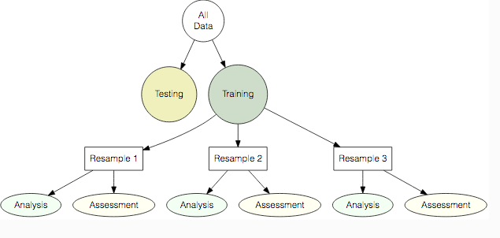
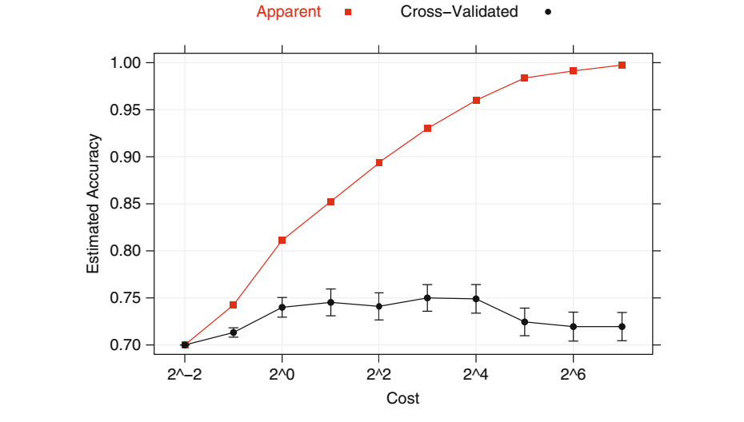
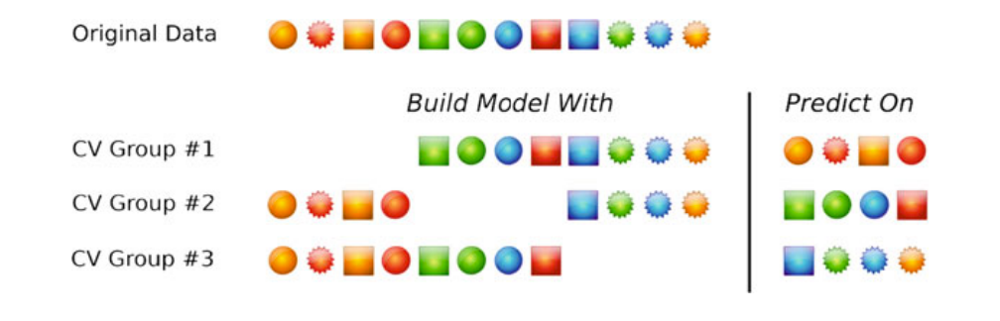
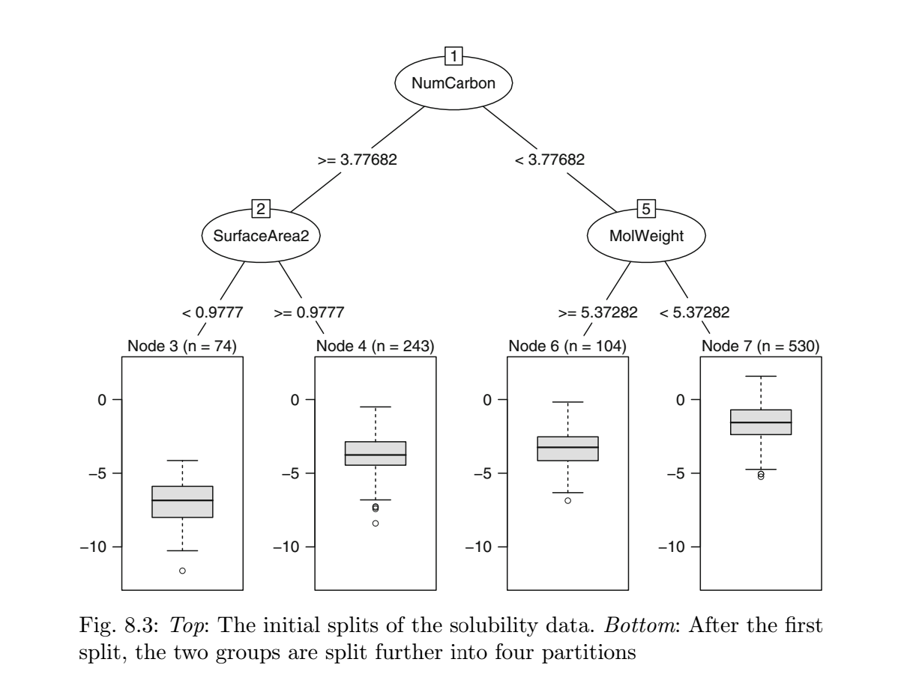
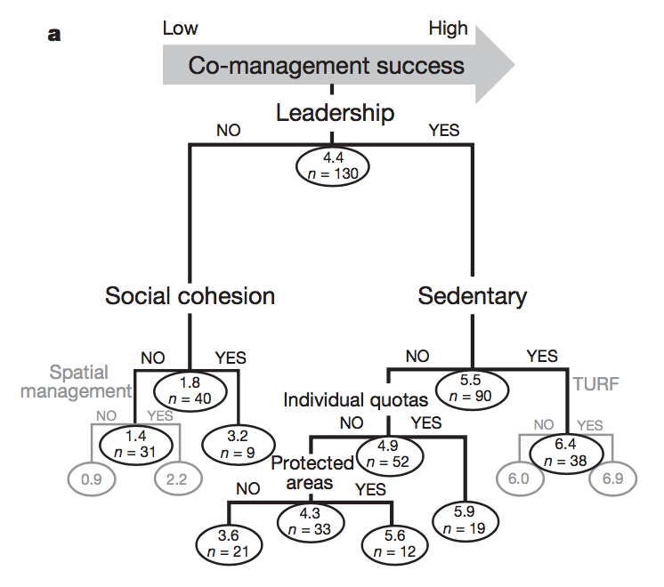

```{r setup, include=FALSE}
set.seed(43)

knitr::opts_chunk$set(echo = T, message = F, warning = F, cache = FALSE)
library(recipes)
library(rsample)
library(caret)
library(broom)
library(tidyposterior)
library(tidyverse)

theme_set(theme_minimal(base_size = 14, base_family = "Arial"))

```


# Predictive Modeling

We usually model for two reasons:

  - Understand a process: 
      
      - "How do tax cuts affect economic growth?"
      
      - regressions, structural modeling
   
  - Make predictions: 
  
      - "How many salmon will I have next year?"
      
      - regressions, structural modeling, **machine learning**

See [Applied Predictive Modeling](http://appliedpredictivemodeling.com/) by Kuhn & Johnson

Predictive modeling is both harder and easier than "estimation" modeling

  - Predictions are hard: We can get still get precise estimates from model that's bad at predicting
  
  - Success is easy to measure: did you predict well or not?
Because just about any predictive model has the same objective, they can all be broken down into about the same process

This workshop is going to spend very little time on actual machine learning, and a lot of time getting used to the standard workflow for predictive modeling. 

1. Decide what you're trying to predict

2. Decide what you're going to use to predict

3. Split your data into "analysis" (training) and "assessment" (test) sets

4. Split your analysis data up many more times to tune models

5. "Feature engineer" your data splits (center-scale, box-cox transformations, polynomials, etc.)

6. Tune nuisance parameters (number of splits, number of trees, etc.)

7. Once you've got your "best" model, train it on the training data, test it on the testing

8. Repeat for many different models

In this example we're going to walk through how to use some of the tools and ideas presented in Max Kuhn's Applied Predictive Modeling shortcourse from RStudio::conf2018.


# A Few General Notes

## What the hell does "machine learning" mean?

This is my own definition, so take it with a grain of salt. We can roughly call non-machine learning techniques "statistical models". These can span from OLS to some crazy GAMM and every non-linear combination in between. These models all share a common link: at their core they make some statistical assumption about the error distribution of the model, and use various pieces of voodoo to tune the model parameters to best satisfy that model. This can be as simple as sum of squares, on up to a full Bayesian posterior. 

All of these methods require us as users to make decisions about what kinds of distributions we want to use, what data we want to use, and how we want to structure the relationships between our data and our outcome of interest. 
Machine learning takes most of this process out of our hands. While any model fitting needs to have some kind of objective function (e.g. minimize RMSE), machine learning isn't looking to fit any specific statistical model, or any specified structural form. Instead, you're telling the machine, given the data and a few guiding principles, find the best way to use that data I've given you to solve the problem I've assigned you. This can span from simpler examples like k-nearest-neighbor models, on up to neural nets, but they all work in a similar process. The advantage to this is that it allows you to fit highly non-linear processes that might not conform to the neat rules of order we impose on the universe through statistical modeling. 

The downside is that we lose most of those tricks for statistical inference that we get from our statistical models (confidence intervals, marginal effects. etc). The other downside is that while statistical models often have theoretical reaons why one particular type of model or specification may be preferable to another, we don't really have that with machine learning models. While some types of ML models seems to be better for different kinds of problems, even the most experienced users don't have a great sense of exactly when (and why) a given type of model works best. As a result, you have to just try a whole bunch of different options. So, being good at applying machine learning is less of an exercise in being statistically saavy and more of an exercise in being a good and efficient programmer. 


## Why R for this?

Machine learning tools often require us to run huge numbers of comutations. Wouldn't we be better off in C++, python, tensorflow, or really anything else faster than R?

The reason that R is great for predictive modeling (and machine learning) is that 90% of the code, from our perpsective, is in data splitting, data processing, running alternate models, etc, and this is the kind of thing that R (and specifically the `tidyverse`) is great at. 

It's pretty unlikely that you'll be coding your own machine learning algorithm, and so most of the time the actual call to your specific algorithm will only take up a few lines your code: all the rest will be data wrangling! Hence, using R as your base and porting to other laungauges where needed is actually a pretty optimal workflow. 


# What are we trying to predict?

For this exercise, we're going to revisit the ideas behind @Costello2012:

**Can we use catch data and life history data to predict B/B~MSY~?**

At its core, this is actually pretty close to an ideal problem for machine learning. We stayted in the paper that we're not really trying to interpret the coeffeficients, we're just interested in predicting, and predicting out-of-sample. 

# Decide what you're going to use to predict

We're going to use RAM v4.25 (with model fits) for this exercise

```{r, message = FALSE, warning=FALSE}

ram <- read_csv(here::here("processed_data", "ram_data.csv"))

DT::datatable(ram, options = list(pageLength = 5))
```

Taking a quick look at our data, we're going to focus on using life history and catch data to predict B/B~MSY~


```{r, fig.cap = "Histogram of total catches"}

ram %>% 
  ggplot(aes(tcbest)) + 
  geom_histogram() + 
  scale_x_log10(labels = scales::comma, name = "Catch")

```


```{r}

ram %>% 
  select(year, bdivbmsypref,udivumsypref) %>% 
  gather(variable, value, contains("pref")) %>% 
  mutate(value = pmin(4,value)) %>% 
  group_by(year, variable) %>% 
  summarise(median_value = median(value, na.rm = T),
            min_value = min(value, na.rm = T),
            max_value = max(value, na.rm = T)) %>% 
  ungroup() %>% 
  ggplot() + 
  geom_ribbon(aes(x = year, ymin = min_value, ymax = max_value),
                  alpha = 0.25) + 
  geom_line(aes(x = year, y = median_value, color = variable)) +
  facet_wrap(~variable)
  
```

To be consistent with @Costello2012, let's add in some lags to the catch data, and a few other goodies. Also, we're not going to tackle the problem of missing data today, but suffice to say that Kuhn & Johnson has a whole chapter to dealing with missing values which is a great tool for any kind of modeling. 

```{r}

important_vars <- 

  candidate_variables <- c("loo","k","winfinity","tmax","tm","m","lm","temperature","tcbest", "tcbest_lag1","tcbest_lag2",
                         "tcbest_lag3","tcbest_lag4")

ram <- ram %>% 
  group_by(stockid) %>% 
  arrange(year) %>% 
  mutate(tcbest_lag1 = dplyr::lag(tcbest,1),
         tcbest_lag2 = dplyr::lag(tcbest,2),
         tcbest_lag3 = dplyr::lag(tcbest,3),
         tcbest_lag4 = dplyr::lag(tcbest,4),
         tcbest_lag5 = dplyr::lag(tcbest,5)) %>% 
  ungroup() %>% 
  mutate(b = pmin(6, bdivbmsypref)) %>% 
  mutate(log_b = log(b)) %>% 
  select(bdivbmsypref, log_b, b, year, region, scientificname, stockid,candidate_variables) %>% 
  na.omit()
  

```

And let's do just a bit of data filtering

```{r}

ram <- ram %>% 
  filter(year >= 1950)

```


And let's just take a look at the relationship between B/B~MSY~ and catch

```{r}

ram %>% 
  ungroup() %>% 
  select(bdivbmsypref, contains("tcbest")) %>% 
  gather(variable, value, -bdivbmsypref) %>% 
  na.omit() %>% 
  mutate(bdivbmsypref = pmin(4,bdivbmsypref)) %>% 
  ggplot(aes(log(value), log(bdivbmsypref), color = variable)) + 
  geom_point(show.legend = F) + 
  geom_smooth(show.legend = F) +
  facet_wrap(~variable)

```

# Split your Data

That's enough data wrangling for now, let's get to predictive modeling. 

Data-splitting is a key concept in predictive modeling. The basic idea: what we care about it predictive accuracry. To gauge that, we needs to create hold-out data that isn't used in the model fitting. 



This can seem like blasphemy, especially in ecologial contexts where data are hard to come by! The question of when and how much to split is a tough one. You can think of it like "spending" your data. You can spend all your data budget on fitting, and have have non left over to validate your fit, or you could spend it all on testing and have no data to fit your model to, or of course, find some balance in between that fits your needs. 

To illustrate why this is important, this graph shows the accuracy of a predictive model on the model data the model was trained on (red) and the accuracy of the model on data held out from the training proces (black). We'll come back to this graph later. 





Our first step, let's split our data into training and testing sets. Out purpose is to be good at predicting. So, we want a nice clean set of data (the testing set), that the model hasn't been anywhere near. We won't touch this split until we're ready to publish. 

The `rsample` package is where most of this stuff lives

```{r}

ram_split <- rsample::initial_split(ram %>% ungroup(), prop = .8)

ram_train <- rsample::training(ram_split)

ram_test  <- rsample::testing(ram_split)

```


```{r}
ram_train %>% 
  mutate(source = "train") %>% 
  bind_rows(ram_test %>% mutate(source = "test")) %>% 
  group_by(region, source) %>% 
 count() %>% 
  group_by(source) %>% 
  mutate(n = n / sum(n)) %>% 
  ungroup() %>% 
  mutate(region = fct_reorder(region, n)) %>% 
  ggplot(aes(region, n, fill = source)) + 
  geom_col(position = "dodge") + 
  coord_flip()
```

In this case randomized sampling mostly preserved the regional distribution of our data, but we can specify stratified random sampling if we want


```{r}

ram_split <- rsample::initial_split(ram %>% ungroup(), prop = .8, strata = "region")

ram_train <- rsample::training(ram_split)

ram_test  <- rsample::testing(ram_split)

ram_train %>% 
  mutate(source = "train") %>% 
  bind_rows(ram_test %>% mutate(source = "test")) %>% 
  group_by(region, source) %>% 
 count() %>% 
  group_by(source) %>% 
  mutate(n = n / sum(n)) %>% 
  ungroup() %>% 
  mutate(region = fct_reorder(region, n)) %>% 
  ggplot(aes(region, n, fill = source)) + 
  geom_col(position = "dodge") + 
  coord_flip()


```

You can imagine lots of other ways to break out this initial split, depending on what kind of predictive power matters to you (e.g. we could instead split the data up into pre 2005 and post 2005). 

# Split your analysis data up many more times to tune models

  
Now we've got our data, we now want to create several more splits of the `training` data for model tuning and design

v-fold cross validation splits the data into v different blocks, each with roughly the same number of unique observations in it

- generates *v* sets of "assessment" data with no overlap with the others

`rsample::vfold_cv` does this for you, and stores indicies to the subsampled data instead of repeated copies 

-Kuhn recommends 10 fold cross validation with 5 repeats





```{r}

ram_vfold <- rsample::vfold_cv(ram_train, v = 5, repeats = 1) 

head(ram_vfold)

```

Now we have a bunch of analysis and assessments splits to the data that we're going to use to develop our predictive model. We could also have used bootstrapping

```{r}

ram_boot <- rsample::bootstraps(ram_train, strata = "region")

head(ram_boot)

```

We'll stick with vfold for now. 

Even at this point we've gottens somewhere pretty cool. We could of course have just run a model on our raw RAM data. This doesn't really give us a measure of OOB predictive power. Now, we can start to get some ectual evidence of our ability. 

To give an example, let's use `purrr` to see how well a simple linear model using catch performs


```{r}

dep_var <- "log_b"

ind_vars <- c('tcbest', "tcbest_lag1","tcbest_lag2","tcbest_lag3","tcbest_lag4")

split <- ram_vfold$splits[[1]]

lm_foo <- function(dep_var, ind_vars, split){
  
  formula <- as.formula(paste0(dep_var, "~", paste(ind_vars, collapse = "+")))
  
  fitted_lm <- lm(formula, data = rsample::analysis(split))
  
  lm_performance <- rsample::assessment(split) %>% 
    modelr::add_predictions(model = fitted_lm)
    
  lm_rq <- yardstick::rsq(lm_performance, truth = log_b, estimate = pred)
  
}

```

A very quick introduction to [`purrr`](http://www.weirdfishes.blog/blog/practical-purrr/)..


```{r}

ram_vfold <- ram_vfold %>% 
  mutate(rsquare = map_dbl(splits, lm_foo, dep_var = dep_var, ind_vars = ind_vars))

ram_vfold %>% 
  ggplot(aes(rsquare)) + 
  geom_histogram()

```

Woof!

So, there's clearly room for improvement. So let's turn to machine learning and see what we can do. 

# Introduction to Random Forests

Random forests are one of the OG machine learning tools, and honestly one of the simplest and best. It also has the advantage that the algorithm actively pushes back against overfishing (at least for the world of data on which the model is trained). 

A random forest is made up of a bunch of regression trees (GET IT???), so let's first understand what a regression tree is. 

## Regression Tree

Trees can be built for regression (continuous outcome) or classification (discrete outcome). 

For most of our cases we're going to be dealing with continuous outcomes (which makes us the weird people in machine learning), so we'll focus on that. 

A regression tree works by creating a series of splits in the data that in the end create a big pile of nested `if` `else` statements. 

Suppose for a moment that we wanted to build a classification tree to determine if something is a fish or not. We could imagine an algorithm that looked like this

```

if (lives_under_water == F){
  is_fish = FALSE
} else {
  if (has_fur == TRUE){
  is_fish = FALSE
  } else {
    if (lives_in_pineapple == T){
    is_fish = FALSE
    } else{
      is_fish = TRUE
    }   
  }
}

```

This is a classification tree! All the the "machine learning" side is doing is automating the creation of this algorithm for you. 

Moving to regression trees then, here's an example



So how does it get there? Too oversimplify badly....

1. Search over all predictors and values of those predictors and find the split that minimizes the sum of squares of the observed values in a split and the mean predicted value in that split

2. Taking that first split as given, repeate the process at each node

3. Stop when there aren't enough observations left in the terminal nodes (or some other stopping criteria)

And that's it! This gives us something like the outcome of @Gutierrez2012



## Making a Forest

Regression trees are handy since they are somewhat interpretable if the number of splits is relatively low, and in the right circumstances can work pretty well. 

The problem is they tend to be "high variance, low bias". Meaning, they tend to do a really goob job of predicting the data that they are trained on, but the actual structure of the tree can vary wildly with small changes to the input data. Not really an ideal feature for a model that we want to use for out-of-sample prediction. 

Enter the random forest!

Random forests are built up from many regression trees. 

Here's how it works (sort of)

  1. Decide on a number of trees to grow (500 is usually a good start)

  2. For every tree, generate a bootstrapped sample of the training data

  3. At every node sample a random subset of the candidate variables (this is really important) to determine the split at that node

  4. Grow your tree (no pruning)!

The prediction from the forest is then a weighted (weighting methods vary) average of the prediction for a given observation across all the trees. 

This acts to make the process much less high variance, and much better for out of sample prediction. 

The problem is you lose the interpretability of the regression tree; there's not really any way to look at the "coefficients" of a given variable anymore (we'll touch a bit more on this later)

So now let's take a look at actually fitting a random forest

Remember where are left off: we have out V-fold cross validation samples. We want to train random forests to the "analysis" part of each of these splits, and test the performance of the forest on the "assessment" part of the split. 

Do to that, we're going to need to address two problems: feature engineering and parameter tuning

## Tuning Parameters

While statistical models make you specify things like functional forms and error structures, they have the advangatve of having "solutions" to most of their parameters (e.g. a covariance matrix in OLS). 

In contrast, most machine learning approaches have a number of tuning parameters that don't have any analytical solution: the only way to figure out what the "best" values are is to use something like cross validation to test a bunch of alternative values. 

In the case of random forests, the most common tuning parameter is the number of variables to randomly sample at each node, a parameter that for some unholy reasons is usually called *m~try~*. A decent starting guess for  *m~try~* is 1/3 the number of parameters (*P*), but you should try a range from 2:*P*, though if *P* is huge you can 

There are a LOT of different packages out there for running random forests, and each of them has their own tuning parameters. We're going to use the `ranger::ranger` function here. The other tuning parameter for `ranger` is `splitrule`, which is the rule by which each tree decides to make a tree. The options are "variance", "extratrees" or "maxstat" (don't ask me what these mean). 

There are lots of other options you can mess with with, but these are the basics. So, we have to devide on `mtry` and `splitrule`, how do we make that decision? Well, we already have our nice analysis-assessment data splits that we created with `vfold`. Why don't we test every combination of `mtry` and `splitrule` on each of those splits and see which one works best?

To do that, say hello to your new best friend in machine learning, `expand.grid`! `expand.grid` creates factorial combinations of each of the elements that you pass it. 

```{r}

candidate_variables <- c("loo","k","winfinity","tmax","tm","m","lm","temperature","tcbest", "tcbest_lag1","tcbest_lag2",
                         "tcbest_lag3","tcbest_lag4")

candidate_params <- expand.grid(mtry = c(2,round(length(candidate_variables)/3), length(candidate_variables)),
                                splitrule = c("variance", "extratrees","maxstat")) %>% 
  as_data_frame()

candidate_params

```

Now, we need to use each of these combinations to fit a random forest to every analysis split in our data. 


## Feature Engineering

Inside of each these fits, we need to think about "feature engineering". 

Feature engineering refers to the decisions we make about how we want to represent the data that we include in the model (in statistics this would commonly be called "preprocessing"). 

We can think of the decision to log transform B/B~MSY~ as "feature engineering". We can also make lots of decisions about how to represent the independent variables. 

In @Costello2012, we scaled catch by max catch: this is feature engineering. 

What about if we wanted to include a variable like "year". Do we want to include it as a continuous variable, or a set of dummy variables as factors? 

Feature engineering can make or break a model, in some cases due to the numerical ability of the model to make predictions (e.g. using PCA to make candidate variables independent of each other), or simply by making the numerical fitting process much easier. For example, many numerical fitting techniques work **much** better if the data are centered and scaled (where that means for each observation subtracting the mean and dividing by the standard deviation of the variable).

Consider the case we have here: in our candidate variables we have both total catch and natural mortality. 

```{r}

ram %>% 
  select(tcbest, m) %>% 
  gather(variable, value) %>% 
  ggplot(aes(value, fill = variable)) + 
  geom_histogram(show.legend = F) + 
  facet_wrap(~variable, scales = "free_x")

```

These data are on completely different scales: a change of 0.1 in *m* is a big deal while the same unit change is meaningless for tcbest. 

There's a whole literature on this, and most of the methods are relatively simple. 
The [`recipes`](https://topepo.github.io/recipes/) package helps with this process. 

As the name implies, the package views modeling like a recipe, that takes data as ingredients and feature selection steps as cooking instructions. This allows model "recipes" to easily be carried around and passed to new data, and makes the process a bit more standardized and easy to read. 

Let's take a look. 


```{r}

dep_var <- "b"

ram_recipe <- recipes::recipe(b ~ ., data = ram %>% select(dep_var, candidate_variables))

```

This is our start, out recipe is a model with 1 outcome and 13 predictors. 

Now, before we manually added a variable called log_b to the data. There's not really a problem with that, but with recipes we can make all these choices part of one process

```{r}

ram_recipe <- ram_recipe %>% 
  recipes::step_log(all_outcomes())

ram_recipe

```


Now suppose that we want to center and scale all of the independent variables

```{r}

ram_recipe <- ram_recipe %>% 
recipes::step_center(all_predictors()) %>% 
recipes::step_scale(all_predictors())

```

Alright, so how do we use this?

Our first step is to `prep` the recipe. During the `prep` step, the recipe calculates steps required by the `recipes` on the supplied data. In this case, it calculates the mean and the standard deviation of each of the columns for use in centering and scaling (but it doesn't do that step yet)


```{r}

prepped_ram <- recipes::prep(ram_recipe, training = ram)

prepped_ram
```

Now that we've prepped the recipe, to actually get our processed data, we `bake` it!


```{r}

baked_ram <- recipes::bake(prepped_ram, newdata = ram)

head(baked_ram)

```

And there you go!

So what, you might ask, is the benefit of this?

There's a couple things I really like about this. 

  - It helps with organization: it makes all the data processing steps clearly documented, reducing potential for error
  
  - It keeps your raw data "rawer", without the need to manually add in a bunch of interactions for example
  
  - It has a TON of build in features, and the list is growing ([custom steps](https://topepo.github.io/recipes/articles/Custom_Steps.html) can also be written)
  
    - box-cox, center-scaling, PCA, polynomials, interactions, etc.
    
  - It standardizes methods for some things
  
There are also things I'm not sure about so far. It's a little scary to have a function doing this much unsupervised data wrangling. Personally, for more complicated things (like PCA transformation, or near-zero-variance filtering), I would do it manually and compare results to try and understand exactly what is happening and why. 


The other really useful feature of recipes specific to predictive modeling is that it helps you make sure that you keep your test and training (and analysis and assessment) data siloed. 

For example, suppose that we centered and scaled our RAM data before passing it to our vfold cross validation. If we do that, some information from the other folds "leaks" into each of the folds, through the mean and the standard deviation in this case. Same problem with the test and training data. 

A key rule for predictive modeling and data-splitting is that any feature selection needs to happen **INSIDE* of any data-splitting. 

This will become more clear as we move on. 

## Tuning our Models

Now, we've got our test and training splits, and we have our v-fold cross validation splits of the training data. 

We also have a grid of tuning parameters that we want to test

We also have our recipe for processing the data that we want to use in the model. 

We're now ready to start fitting some models. What we need to do is fit our random forest model to the analysis split of each v-fold split, and repeat this process for each combination of our tuning parameters. 

This is giong to take some functional programming and `purrr`

Let's look at our functions first. Our goal is a function that returns a metric of choice, say  the mean root mean squared error (RMSE) of the random forest trained on the analysis data and tested on the assessment  for each combination of the tuning parameters. 

Inside the most nested part of this process, we'll use our recipe to process the analysis data. 


```{r}

fit_forests <- function(mtry, splitrule, splits, candidate_variables, recipeee){
  
  test_ranger <- function(split, candidate_variables, mtry, splitrule,recipeee){
    
    analysis_data <- rsample::analysis(split) 
    
    prepped_recipe <- recipes::prep(recipeee, training = analysis_data)
    
    analysis_data <- bake(prepped_recipe, newdata = analysis_data)
    
    assessment_data <- bake(prepped_recipe, newdata = rsample::assessment(split))
    
    fitted_forest <- ranger::ranger(b ~ ., data = analysis_data, mtry = mtry, splitrule = splitrule)
    
    assessment_data$prediction = predict(fitted_forest, data = assessment_data)$predictions
    
    metric <- yardstick::rmse(assessment_data,truth = b, estimate = prediction)
    
  }
  
  splits <- splits %>% 
    mutate(fitted_forest = map_dbl(splits, test_ranger, candidate_variables = candidate_variables, mtry = mtry, splitrule = splitrule,recipeee = recipeee))
  
  mean_metric <- mean(splits$fitted_forest)
}

```


```{r}

candidate_params <- candidate_params %>% 
  mutate(ranger_rmse = map2_dbl(mtry, splitrule, fit_forests, splits = ram_vfold, candidate_variables = candidate_variables, recipeee = ram_recipe))

candidate_params <- candidate_params %>% 
  arrange(ranger_rmse)

best_mtry <- candidate_params$mtry[1]

best_splitrule <- candidate_params$splitrule[1]

candidate_params %>% 
  ggplot(aes(splitrule, ranger_rmse, fill = factor(mtry))) + 
  geom_col(position = "dodge")


```

Great, now we've got values for our tuning parameters. 

Time to predict our testing data right?? 

We've forgotten one key step in here: model comparison! We just tried one model, a random forest fit using ranger. We should always be running alternative models and comparing them though. 

For example, let's not fit alinear version of the model using the parameters we used above. This is basically model 1 from @Costello2012.

We're going to use the amazingly named [`tidyposterior`](https://topepo.github.io/tidyposterior/) package to do this. 

First, we're going to calcualte a metric we care about, say root mean squared error (RMSE) for our two candidate models, the linear regression and the random forest

```{r}

lm_foo <- function(split, ind_vars,recipeee){
  
  formula <- as.formula(paste0("b ~ ", paste(ind_vars, collapse = "+")))
  
   prepped_recipe <- recipes::prep(recipeee, training =   rsample::analysis(split))
    
    analysis_data <- bake(prepped_recipe, newdata = rsample::analysis(split))
    
    assessment_data <- bake(prepped_recipe, newdata = rsample::assessment(split))
    
    fitted_lm <- lm(b ~ ., data = analysis_data)
  
  lm_performance <- assessment_data %>% 
    modelr::add_predictions(model = fitted_lm)
    
  metric <- yardstick::rmse(lm_performance, truth = b, estimate = pred)
  
}

  ranger_foo <- function(split, candidate_variables, dep_var, mtry, splitrule,recipeee){
    
     analysis_data <- rsample::analysis(split) 
    
    prepped_recipe <- recipes::prep(recipeee, training = analysis_data)
    
    analysis_data <- bake(prepped_recipe, newdata = analysis_data)
    
    assessment_data <- bake(prepped_recipe, newdata = rsample::assessment(split))
    
    fitted_forest <- ranger::ranger(b ~ ., data = analysis_data, mtry = mtry, splitrule = splitrule)
    
    assessment_data$prediction = predict(fitted_forest, data = assessment_data)$predictions
    
    metric <- yardstick::rmse(assessment_data,truth = b, estimate = prediction)
    
  }

  ram_vfold <- ram_vfold %>% 
  mutate(lm_rmse = map_dbl(splits, lm_foo, ind_vars = candidate_variables,recipeee = ram_recipe),
         ranger_rmse = map_dbl(splits, ranger_foo, candidate_variables = candidate_variables, mtry = candidate_params$mtry[1], splitrule = candidate_params$splitrule[1], recipeee = ram_recipe))
  
  
ram_vfold

```

Now, we have multiple draws of the RMSE of two competing models, and we want to ask the question, which is better?

That sounds like a job for statistics! There are lots of ways we could think about solving this, but `tidyposterior` leverages the numerical advantages of cross validation to this in a really clever way. 

What we'd love to be able to say is, what is the probability that model A is better than model B? Well, we now have some "data" on this: repeated observations of the performance of each model. So, we could think now that we might be able to get to the probability that a given model is better than another conditional on the observed data... this should be starting to ring some bells for any Bayesians!

`tidyposterior` uses stan to run a Bayesian hierarchichal linear model of the form

$$ metric_{i} \sim \beta_0 +  \beta_{1}lm_i + \beta_2forest_i$$

where *i* is each split of the data. 

```{r}

ram_performance <- perf_mod(ram_vfold %>% select(-rsquare), seed = 42)


```

```{r, eval = F}
rstanarm::launch_shinystan(ram_performance$stan)

```


This gives us posterior probability distributions around the RMSE for each of the models. We can formally compare the differences between these two models using the `contrast_models` function. 

```{r}

forest_v_lm <- contrast_models(ram_performance, "ranger_rmse","lm_rmse")

summary(forest_v_lm)

```

`contrast_models` also has a bunch of built in plotting features. If we've got enough data, it's pretty easy to find "differences" between models that might be trivial. We might be able to isolate a change in RMSE performance of 0.0001, but is that really meaningful?

Thinking about our outcome of interest, we want to predict B/B~MSY~. Our RMSE is units of log(B/B~MSY~). B/B~MSY~ should be somewhere between 0 and 4, so log(B/B~MSY) should be between -2 and 1. Let's say then that we'd call a model whose RMSE is 0.1 (in units of log(B/B~MSY~)) better than another to be meaningfully better. 

```{r}

ggplot(forest_v_lm, size = 0.1)

```

And voila! we have a posterior probability distribution of how much better, in terms of RMSE, the random forest is to the linear model. Specifically, we're pretty sure that the random forest has on average a RMSE 0.45 lower than the linear model, and we can say that this effect is definitely meaningful to us. 

## Putting it all together

So, now we've tuned our random forest, and we've got candidate models to compare. We can finally get back to our testing data!

Our first step now that we've tuned our random forest is to now used those tuned parameters to fit the model to the entire training data (good by vfold!) 


```{r}


prepped_ram <- prep(ram_recipe, training = ram_train)

fitted_forest <-
ranger::ranger(
b ~ .,
data =  bake(prepped_ram, newdata = ram_train),
mtry = best_mtry,
splitrule = best_splitrule,
importance = "impurity_corrected"
)

fitted_lm <-
lm(b ~ ., data =  bake(prepped_ram, newdata = ram_train))

```

One quick thing, we can take a moment here to look at variable importance plots. This about the simplest (and almost only) form of "interpretation" we can get out of a random forest. 

Variable importance is a measure of how many times a given variable was selected at a split: the more times a variable is selected as a splitting variable, the more important it is to the model. This doesn't say anything about the effect size or direction of the variable, just that it's a useful predictor. 

```{r}

variable_importance <-
  data_frame(
  variable = names(ranger::importance(fitted_forest)),
  importance = ranger::importance(fitted_forest)
  ) %>% 
  mutate(variable = fct_reorder(variable, importance)) %>% 
  ggplot(aes(variable, importance)) + 
  geom_col() + 
  coord_flip()

variable_importance

```

And now that we have our fits, we can use these models to predict our testing data and see how we did. 

```{r}


ram_results <- bake(prepped_ram, newdata = ram_test) %>% 
  mutate(lm_pred = predict(fitted_lm, newdata = bake(prepped_ram, newdata = ram_test)),
         forest_pred = predict(fitted_forest, data = bake(prepped_ram, newdata = ram_test))$predictions)

ram_results %>% 
  select(b, lm_pred, forest_pred) %>% 
  gather(model, prediction, contains("pred")) %>% 
  ggplot(aes(b, prediction, color = model)) + 
  geom_point() + 
  geom_abline(aes(intercept = 0, slope = 1), color = "red") + 
  facet_wrap(~model)

```

Boom! Science here we come. 

# caret

Now that we've gone through each step in the predictive modeling process painfully by hand, I'm now going to show you `caret`. 

`caret` takes care of almost all of these steps for you. Here's now to fit that whole tuning, cross validation, etc. stuff we did in caret. 

```{r}


fit_control <- trainControl(
  method = "repeatedcv",
  number = 5,
  repeats = 1,
  allowParallel = TRUE
  )
  
  caret_forest <-
  caret::train(
  ram_recipe,
  data = ram_train,
  method = "ranger",
  trControl = fit_control
  )


  ram_results <- ram_results %>% 
  mutate(caret_pred = predict(caret_forest$finalModel, data = ram_results %>% select(candidate_variables))$predictions)

ram_results %>% 
  select(b, lm_pred, forest_pred, caret_pred) %>% 
  gather(model, prediction, contains("pred")) %>% 
  ggplot(aes(b, prediction, color = model)) + 
  geom_point() + 
  geom_abline(aes(intercept = 0, slope = 1), color = "red") + 
  facet_wrap(~model)

```

The `caret` package is incredibly well documented [here](http://topepo.github.io/caret/index.html), so I'll leave it to you to go and dig into it, but basically it has routines to automate all of the process of splitting into test and training, splitting training into analysis and assessment, feature selection,model tuning,etc, and it has this capacity for hundreds of possible model types. 

Unfortunately, as a result `caret` is about as untidy as a function comes, and Max Kuhn is in the process of developing a new package that will attempt to tidy up this process. But for now, caret is a great way to go once you've gotten a feel for what's actually going on by doing it the hard way. Don't hate me!

# Neural Nets


